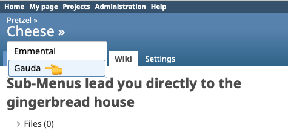

# Redmine Submenus Plugin


A Redmine plugin that adds dropdown navigation to project and wiki titles, giving instant access to subprojects and wiki subpages without leaving the current context.

> Built for teams working with complex project hierarchies who value quick navigation over cluttered menus.

## Screenshots



## Features

- **Project dropdowns**: instant access to subprojects directly from the project title
- **Wiki dropdowns**: quick navigation to child wiki pages from the current page
- **Context-preserving**: maintains the current tab (Issues, Wiki, etc.) when navigating to a subproject
- **Configurable symbol**: choose your own dropdown trigger character

## Requirements

- Redmine 5.0 or higher

## Installation

> [!IMPORTANT]
> The plugin directory **MUST** be named `redmine_submenus` for assets to load correctly.

1. **Clone** into your plugins directory:
   ```bash
   cd /path/to/redmine/plugins
   git clone https://github.com/subversive-tools/redmine_submenus.git redmine_submenus
   ```

2. **Restart Redmine**.

## Configuration

Navigate to **Administration > Plugins > Submenus > Configure**.

| Option | Description | Default |
|:---|:---|:---|
| **Show subprojects menu** | Enable dropdown on project titles | Enabled |
| **Show subwiki menu** | Enable dropdown on wiki page titles | Enabled |
| **Dropdown symbol** | Trigger character shown next to titles | `»` |

## Usage

Once enabled, a small trigger symbol appears next to project and wiki page titles. Clicking it opens a dropdown listing all accessible subprojects or child wiki pages. Navigation preserves the current Redmine tab — if you are on the Issues tab of a parent project, clicking a subproject in the dropdown takes you to the Issues tab of that subproject.

## Troubleshooting

**Dropdown not appearing?**
- Verify the plugin is enabled under Administration > Plugins.
- Check that the user has access to at least one subproject or child wiki page.
- Ensure subprojects are active and visible.

## Contributing

Contributions are welcome — please fork the repository and open a Pull Request.

1. Fork it
2. Create your feature branch (`git checkout -b feature/my-feature`)
3. Commit your changes
4. Push to the branch
5. Open a Pull Request

## License

[MIT License](LICENSE) — Copyright (c) 2026 Stefan Mischke
